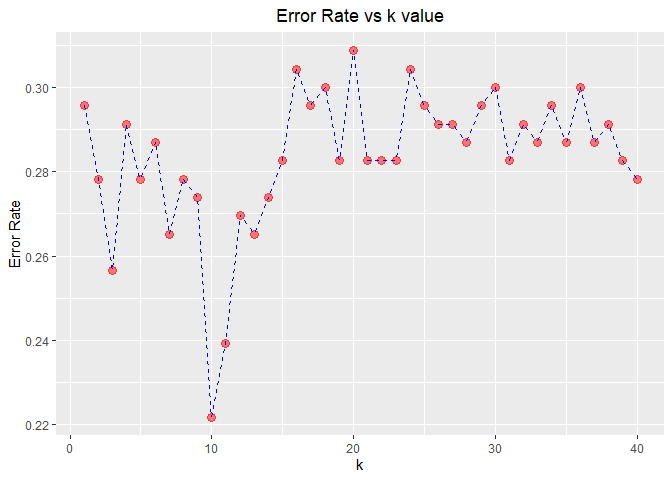
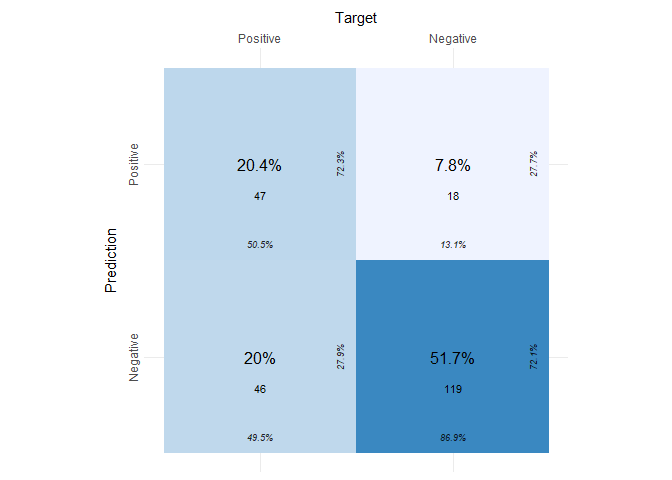

-   <a href="#business-understanding"
    id="toc-business-understanding">Business Understanding</a>
-   <a href="#data-understanding" id="toc-data-understanding">Data
    Understanding</a>
-   <a href="#data-preparation" id="toc-data-preparation">Data
    Preparation</a>
-   <a href="#modeling" id="toc-modeling">Modeling</a>
-   <a href="#evaluation-and-deployment"
    id="toc-evaluation-and-deployment">Evaluation and Deployment</a>
-   <a href="#references" id="toc-references">References</a>

## Business Understanding

Diabetes prevents your body to turn food intor energy. This can cause
serious health problems, such as heart disease, vision loss, and kidney
disease <span style="color:blue">*(What Is Diabetes?, 2022)*</span>.
Diabetes can be treated and be recognized early before it turns into an
urgent case by doing some testing (blood glucose). Diabetes detection
with early symptoms can reduce the death rate and prevent it from
getting worse before it is too late. With machine learning algorithms,
it could improve the accuracy and effectiveness of detection.

## Data Understanding

The dataset is orginially retrieved from National Institute of Diabetes
and Digestive and Kidney Diseases.With the result of diagnostic
measurements, a patient is predicted to have diabetes or not. Donor
database is Vincent Sigillito from RMI Group Leader Applied Physics
Laboratory The Johns Hopkins University Johns Hopkins Road Laurel. The
dataset used is downloaded from open source <span
style="color:blue">*(Diabetes Dataset, 2020)*</span>. The instances are
females at least 21 years old of Pima Indian heritage.  
The dataset is stored in a Github repo and cloned into local repo. It is
in .csv file. To read this, we use `readr` package.

``` r
rawDF <- read_csv("./datasets/KNN-diabetes.csv")
```

    ## Rows: 768 Columns: 9
    ## ── Column specification ────────────────────────────────────────────────────────
    ## Delimiter: ","
    ## dbl (9): Pregnancies, Glucose, BloodPressure, SkinThickness, Insulin, BMI, D...
    ## 
    ## ℹ Use `spec()` to retrieve the full column specification for this data.
    ## ℹ Specify the column types or set `show_col_types = FALSE` to quiet this message.

By using `str()` function, we can have first sense of data.

``` r
str(rawDF)
```

    ## spc_tbl_ [768 × 9] (S3: spec_tbl_df/tbl_df/tbl/data.frame)
    ##  $ Pregnancies             : num [1:768] 6 1 8 1 0 5 3 10 2 8 ...
    ##  $ Glucose                 : num [1:768] 148 85 183 89 137 116 78 115 197 125 ...
    ##  $ BloodPressure           : num [1:768] 72 66 64 66 40 74 50 0 70 96 ...
    ##  $ SkinThickness           : num [1:768] 35 29 0 23 35 0 32 0 45 0 ...
    ##  $ Insulin                 : num [1:768] 0 0 0 94 168 0 88 0 543 0 ...
    ##  $ BMI                     : num [1:768] 33.6 26.6 23.3 28.1 43.1 25.6 31 35.3 30.5 0 ...
    ##  $ DiabetesPedigreeFunction: num [1:768] 0.627 0.351 0.672 0.167 2.288 ...
    ##  $ Age                     : num [1:768] 50 31 32 21 33 30 26 29 53 54 ...
    ##  $ Outcome                 : num [1:768] 1 0 1 0 1 0 1 0 1 1 ...
    ##  - attr(*, "spec")=
    ##   .. cols(
    ##   ..   Pregnancies = col_double(),
    ##   ..   Glucose = col_double(),
    ##   ..   BloodPressure = col_double(),
    ##   ..   SkinThickness = col_double(),
    ##   ..   Insulin = col_double(),
    ##   ..   BMI = col_double(),
    ##   ..   DiabetesPedigreeFunction = col_double(),
    ##   ..   Age = col_double(),
    ##   ..   Outcome = col_double()
    ##   .. )
    ##  - attr(*, "problems")=<externalptr>

The dimension of dataset is 768 x 9, which means that the data has 768
observations and 9 variables The data type of all variables are `num`.
We can use `summary` function to see the summary information of each
variable and we can check if each has Nas values, which we need to
clean.

``` r
summary(rawDF)
```

    ##   Pregnancies        Glucose      BloodPressure    SkinThickness  
    ##  Min.   : 0.000   Min.   :  0.0   Min.   :  0.00   Min.   : 0.00  
    ##  1st Qu.: 1.000   1st Qu.: 99.0   1st Qu.: 62.00   1st Qu.: 0.00  
    ##  Median : 3.000   Median :117.0   Median : 72.00   Median :23.00  
    ##  Mean   : 3.845   Mean   :120.9   Mean   : 69.11   Mean   :20.54  
    ##  3rd Qu.: 6.000   3rd Qu.:140.2   3rd Qu.: 80.00   3rd Qu.:32.00  
    ##  Max.   :17.000   Max.   :199.0   Max.   :122.00   Max.   :99.00  
    ##     Insulin           BMI        DiabetesPedigreeFunction      Age       
    ##  Min.   :  0.0   Min.   : 0.00   Min.   :0.0780           Min.   :21.00  
    ##  1st Qu.:  0.0   1st Qu.:27.30   1st Qu.:0.2437           1st Qu.:24.00  
    ##  Median : 30.5   Median :32.00   Median :0.3725           Median :29.00  
    ##  Mean   : 79.8   Mean   :31.99   Mean   :0.4719           Mean   :33.24  
    ##  3rd Qu.:127.2   3rd Qu.:36.60   3rd Qu.:0.6262           3rd Qu.:41.00  
    ##  Max.   :846.0   Max.   :67.10   Max.   :2.4200           Max.   :81.00  
    ##     Outcome     
    ##  Min.   :0.000  
    ##  1st Qu.:0.000  
    ##  Median :0.000  
    ##  Mean   :0.349  
    ##  3rd Qu.:1.000  
    ##  Max.   :1.000

Then we should check if the data has duplicated values

``` r
dup_check <- sum(duplicated(rawDF))
dup_check
```

    ## [1] 0

## Data Preparation

The `outcome` variable has the values we need to predict “0 - negative”
and “1 - positive”.We need to set level and label for it to easily sort
or call it later.

``` r
rawDF$Outcome <- factor(rawDF$Outcome, levels = c(0, 1), labels = c("Negative", "Positive")) %>%  relevel("Positive")
```

We can clearly see that the variables have different ranges. We need to
normalize it before splitting into train and test set.

``` r
normalize <- function(x) {
  return ((x - min(x)) / (max(x) - min(x)))
}
cleanDF <- rawDF 
cleanDF[,1:8] <- normalize(cleanDF[,1:(ncol(rawDF)-1)])
summary(cleanDF)
```

    ##   Pregnancies          Glucose       BloodPressure     SkinThickness    
    ##  Min.   :0.000000   Min.   :0.0000   Min.   :0.00000   Min.   :0.00000  
    ##  1st Qu.:0.001182   1st Qu.:0.1170   1st Qu.:0.07329   1st Qu.:0.00000  
    ##  Median :0.003546   Median :0.1383   Median :0.08511   Median :0.02719  
    ##  Mean   :0.004545   Mean   :0.1429   Mean   :0.08168   Mean   :0.02427  
    ##  3rd Qu.:0.007092   3rd Qu.:0.1658   3rd Qu.:0.09456   3rd Qu.:0.03783  
    ##  Max.   :0.020095   Max.   :0.2352   Max.   :0.14421   Max.   :0.11702  
    ##     Insulin             BMI          DiabetesPedigreeFunction      Age         
    ##  Min.   :0.00000   Min.   :0.00000   Min.   :0.0000922        Min.   :0.02482  
    ##  1st Qu.:0.00000   1st Qu.:0.03227   1st Qu.:0.0002881        1st Qu.:0.02837  
    ##  Median :0.03605   Median :0.03783   Median :0.0004403        Median :0.03428  
    ##  Mean   :0.09433   Mean   :0.03782   Mean   :0.0005578        Mean   :0.03929  
    ##  3rd Qu.:0.15041   3rd Qu.:0.04326   3rd Qu.:0.0007402        3rd Qu.:0.04846  
    ##  Max.   :1.00000   Max.   :0.07931   Max.   :0.0028605        Max.   :0.09574  
    ##      Outcome   
    ##  Positive:268  
    ##  Negative:500  
    ##                
    ##                
    ##                
    ## 

After running `summary`, we see that normalization has set all the
parameters into the same range Now, we split our data into training and
test sets by using `train_test_split` from package `creditmodel`

``` r
test <- train_test_split(cleanDF)[[1]]
train <- train_test_split(cleanDF)[[2]]
```

These two data frames inclue `outcome`. But we only need parameters
without `outcome` variable to set as `train_feat` or \`test_feat, so we
will exclude that variable.

``` r
test_feat <- test[-9]
train_feat <- train[-9]
```

Creating labels for training and test set

``` r
test_labels <- test[, 9]
train_labels <- train[,9]
```

## Modeling

I will use `knn` from package `class`. It takes the set with
`train_feat` and the set with `train_labels`. The trained model is
applied to the set with `test_feat` and it will return a set of
predictions. First, I find the optimal `k` value to make the knn has the
lowest error rate by creating function `error_k` with the argument `k`.
`error_k` will return a data frame of `error_rate` values corresponding
to `k` values. Using `relevel` function to prevent the warning message ”
Levels are not in the same order for reference and data. Refactoring
data to match” when running `confusionMatrix`.

``` r
error_k <- function(k) {
  error_rate <- data.frame()
  for (i in k) {
      knn <- knn(train = as.matrix(train_feat), test = as.matrix(test_feat), cl = as.matrix(train_labels), k = i)
      knn <- relevel(knn, "Positive")
      matrix <- confusionMatrix(knn, test_labels[[1]], positive = NULL, dnn = c("Prediction", "True"))
      error_rate <- rbind(error_rate, 1-matrix$overall[["Accuracy"]])
  }
  error_k <- data.frame(k, error_rate)
  colnames(error_k) <- c("k", "error_rate")
  error_k
}
```

Now, I will plot error rate with k from 1 to 40.

``` r
plot <- error_k(1:40)
ggplot(plot, aes(x = k, y = error_rate )) +
  geom_point(colour = "red", size = 3, alpha = 0.5) +
  geom_line(colour = "blue", size = 0.7, linetype = 2) +
  labs(title = "Error Rate vs k value") +
  theme(plot.title = element_text(hjust = 0.5)) +
  ylab("Error Rate")
```


As shown in the graph, k = 11 will return the lowest error rate. 11 will
be used as the amount of nearest neighbours `k` in `knn` function below.

``` r
cleanDF_test_pred <- knn(train = as.matrix(train_feat), test = as.matrix(test_feat), cl = as.matrix(train_labels), k = 11)
cleanDF_test_pred <- relevel(cleanDF_test_pred, "Positive")
head(cleanDF_test_pred)
```

    ## [1] Positive Positive Negative Negative Negative Negative
    ## Levels: Positive Negative

We have predicted labels. We will compare with actual labels.

``` r
cf <- confusionMatrix(cleanDF_test_pred, test_labels[[1]], positive = NULL, dnn = c("Prediction", "True"))
cf
```

    ## Confusion Matrix and Statistics
    ## 
    ##           True
    ## Prediction Positive Negative
    ##   Positive       46        8
    ##   Negative       47      129
    ##                                           
    ##                Accuracy : 0.7609          
    ##                  95% CI : (0.7004, 0.8145)
    ##     No Information Rate : 0.5957          
    ##     P-Value [Acc > NIR] : 9.804e-08       
    ##                                           
    ##                   Kappa : 0.4677          
    ##                                           
    ##  Mcnemar's Test P-Value : 2.992e-07       
    ##                                           
    ##             Sensitivity : 0.4946          
    ##             Specificity : 0.9416          
    ##          Pos Pred Value : 0.8519          
    ##          Neg Pred Value : 0.7330          
    ##              Prevalence : 0.4043          
    ##          Detection Rate : 0.2000          
    ##    Detection Prevalence : 0.2348          
    ##       Balanced Accuracy : 0.7181          
    ##                                           
    ##        'Positive' Class : Positive        
    ## 

To visualize the confusion matrix, I will use `plot_confusion_matrix`
function from package `cvms`. First I need to convert matrix type of
`cf` to tibble because this function only accepts data.frame.

``` r
table <- as_tibble(cf$table)
plot_confusion_matrix(table, target_col = "True", prediction_col = "Prediction", counts_col = "n")
```

    ## Warning in plot_confusion_matrix(table, target_col = "True", prediction_col =
    ## "Prediction", : 'ggimage' is missing. Will not plot arrows and zero-shading.

    ## Warning in plot_confusion_matrix(table, target_col = "True", prediction_col =
    ## "Prediction", : 'rsvg' is missing. Will not plot arrows and zero-shading.

    ## Warning: Ignoring unknown parameters: linewidth



## Evaluation and Deployment

56.1% of test feature has True Negative and 20% is True Positive.

## References

-   What is Diabetes? (2022, July 7). Centers for Disease Control and
    Prevention. <https://www.cdc.gov/diabetes/basics/diabetes.html>
-   Diabetes Dataset. (2020, August 5). Kaggle.
    <https://www.kaggle.com/datasets/mathchi/diabetes-data-set>
